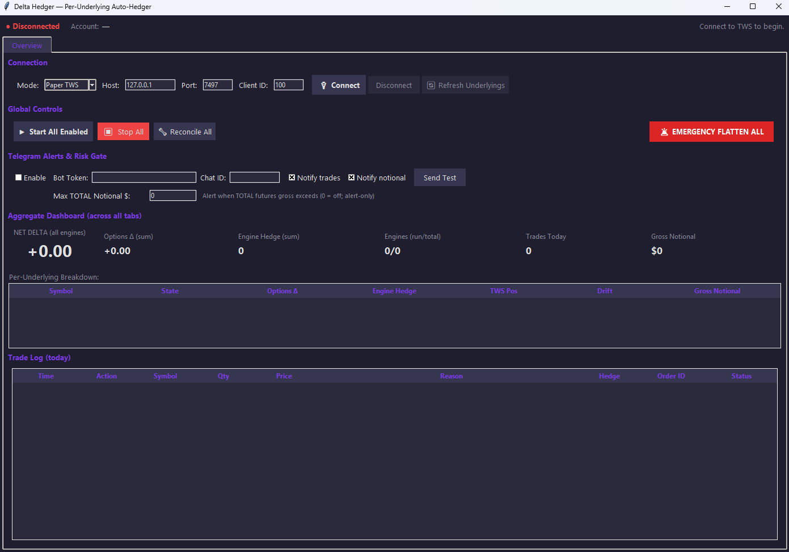
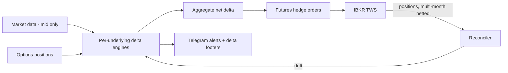

# Delta Hedger — Per-Underlying Auto-Hedger

**Venue:** CME futures via IBKR TWS · **Form:** Tkinter GUI, shipped as `delta_hedger.exe` (PyInstaller)

Production tool that keeps a book of listed options delta-neutral by hedging with CME
futures, per underlying, automatically and continuously.

*Overview tab in Paper-TWS mode. Aggregate dashboard (net delta, options Δ, engine
hedges, gross notional), per-underlying breakdown with drift column, and the day's
trade log.*

## What it does

- **Per-underlying hedge engines.** Each underlying gets its own tab and its own engine:
  its options delta is aggregated and hedged independently, with per-engine start/stop.
- **Multi-month-aware futures netting.** Hedge sizing reads the *netted* live futures
  position across contract months, so a roll or a mixed-month book never double-hedges.
- **Aggregate dashboard.** Net delta across all engines, engines running/total, trades
  today, and gross notional — one glance tells the operator the state of the whole book.
- **Trade log with reasons.** Every hedge order is logged with the reason it fired.

## Safety architecture

The interesting part of a hedger is not the hedging — it is everything that stops a bad
hedge:

- **Mid-market-only delta rule.** Deltas are computed from mid prices only; a crossed or
  one-sided quote cannot poison the hedge quantity.
- **Three-layer wrong-number recovery.** If the engine's book and the broker's book
  disagree, drift is surfaced in its own column and per-engine **Reconcile** buttons
  (plus a global *Reconcile All*) restore exchange truth in one action — no restart, no
  manual math.
- **Phantom-order defense.** Order state transitions are tracked defensively so a stale
  or unacknowledged order can never be counted as a fill.
- **Notional risk gate.** A hard cap on total futures gross notional, with alert-only
  mode for monitoring before enforcement.
- **Telegram risk channel.** Trade and notional alerts with per-asset delta footers, so
  the operator's phone always shows the current per-underlying deltas — not just "a
  trade happened."
- **Emergency Flatten All.** One button, whole book, no confirmation friction when it is
  actually needed.

## Architecture

