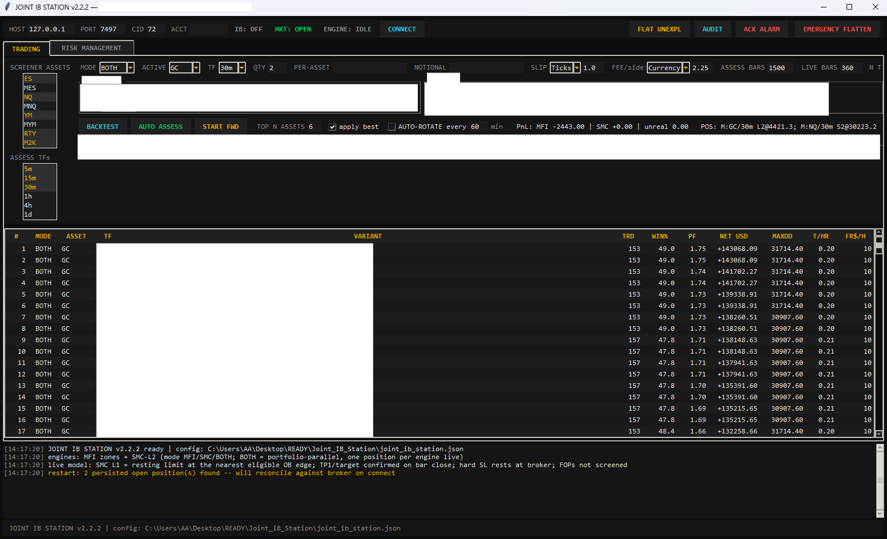
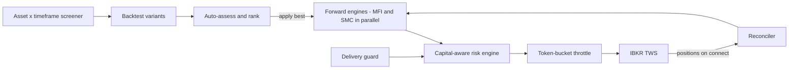

# Joint IB Station v2.2.2 — Dual-Engine Strategy Station

**Venue:** CME futures via IBKR TWS · **Form:** Tkinter GUI · backtest + forward in one tool

A strategy station running two independent engines — an MFI-zone engine and an SMC
(structure-based) engine — portfolio-parallel, one position per engine, over a
configurable asset and timeframe screener.

<!-- SCREENSHOT SLOT: capture the RISK MANAGEMENT tab (paper mode, disconnected),
     save as images/joint_ib_station_risk.png, and this line renders it: -->

*Risk Management tab, paper mode.*

## What it does

- **Two engines, one book discipline.** MFI and SMC engines run side by side on the
  same asset set, each limited to one live position, so the strategies' behaviours stay
  attributable and never compound into accidental leverage.
- **Backtest → assess → forward, in-app.** The same station backtests strategy variants
  across the asset/timeframe grid, auto-assesses and ranks them, applies the best
  configuration, and then runs it forward — one tool, one data path, no
  research-to-production translation gap.
- **Multi-timeframe assessment.** Variants are assessed across timeframes from intraday
  to daily before anything is applied.

## Safety architecture

- **Capital-aware risk engine.** Position sizing and exposure are governed by a risk
  layer that knows the account's capital — not by static contract counts.
- **Token-bucket order throttle.** Order flow is rate-limited at the station level, so
  no engine state, however wrong, can machine-gun the broker.
- **Delivery guard.** Futures positions are guarded against being carried into
  delivery/expiry windows.
- **Reconcile-on-connect.** Persisted open positions found at startup are reconciled
  against the broker before the engine acts — the station's memory never outranks the
  broker's.
- **Operator controls.** Audit view, alarm acknowledgement, *Flat Unexplained* for
  positions the engines cannot account for, and a global emergency flatten.

## Architecture

