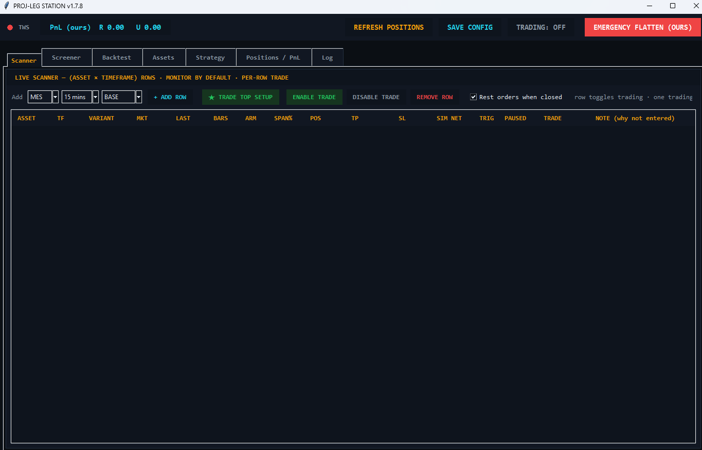
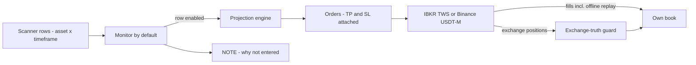

# Proj-Leg Station v1.7.8 — Projection Strategy, Two Venues

**Venues:** CME futures via IBKR TWS (`proj_leg_station.py`) and Binance USDT-M
(`proj_leg_binance.py`) · **Form:** Tkinter GUI

A projection-based strategy station built around a live *(asset × timeframe)* scanner
where every row is its own monitored setup — and trading is opt-in per row, never
global.

*Scanner tab. Rows are (asset, timeframe, variant) tuples; each row shows market state,
position, TP/SL, simulated net, trigger state, and — critically — a NOTE column
explaining why a setup did **not** enter. TRADING: OFF is the default state.*

## What it does

- **Per-row lifecycle.** Each (asset × timeframe) row is monitored by default and traded
  only when individually enabled. *Trade Top Setup* promotes the best row deliberately;
  there is no "trade everything" mode.
- **Explained non-entries.** The NOTE column records why a candidate setup was rejected.
  In live operation, knowing why the system *didn't* trade is worth as much as knowing
  why it did.
- **Full pipeline in tabs.** Screener, backtest, asset config, strategy config,
  positions/PnL, and log live in one window — the same station researches and runs the
  strategy.
- **Cross-venue port.** The identical engine runs on Binance USDT-M perpetuals, proving
  the strategy and its guards against a completely different exchange API, margin
  model, and failure surface.

## Safety architecture

- **Exchange-truth position guards.** The station's book is continuously checked against
  the exchange's; the exchange wins every disagreement.
- **Offline fill replay.** Fills that arrive while the station is down are replayed on
  reconnect, so restarts cannot create untracked positions.
- **Own-book scoping.** PnL is tracked as *ours*, and the emergency flatten is
  **EMERGENCY FLATTEN (OURS)** — it kills this station's exposure without touching
  anything else in the account.
- **Resting-order hygiene.** *Rest orders when closed* ensures no orphaned working
  orders survive a closed position.

## Architecture

