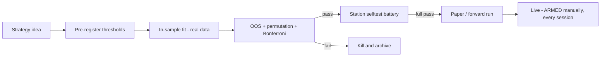

# Research Infrastructure — How Strategies Earn Production

No screenshots of alpha here. This page documents the part of the work that decides
whether anything else in this repo is allowed to trade: validation, falsification, and
testing discipline.

<!-- SCREENSHOT SLOT (optional): a terminal capture of a selftest battery passing,
     saved as images/selftest_battery.png, renders here: -->
<!--  -->

## Pre-registration and kill rules

Every strategy candidate is tested against thresholds that are written down **before**
the backtest runs:

- **In-sample / out-of-sample splits** on real market data only — synthetic or
  demo-data results are banned outside deterministic test fixtures.
- **Multiple-comparison correction** (Bonferroni) across variant sweeps, so a big
  parameter grid cannot manufacture significance.
- **Permutation tests** against the appropriate null, not just raw PnL.
- **Kill rules that actually fire.** One flagship signal family, after months of
  engineering across venues, failed its pre-registered out-of-sample thresholds
  (OOS t = −1.71, permutation p = 0.98) — and was killed and archived per the rules,
  not rescued with a new parameter set. The discipline is only real if it costs you
  something; this one did.

## Invariant sweeps

Signal implementations are locked with invariant test sweeps — on the order of a
thousand-plus generated cases per signal — that pin the transform's behaviour across
edge cases before any port. When the same signal runs on IBKR CME futures and on
Binance USDT-M, the sweep is what guarantees "the same signal" is a fact and not a
hope.

## Deterministic selftest batteries

Every station embeds its own test battery; a station that cannot pass its battery does
not deploy. Recent batteries at full pass:

| Station | Battery |
|---|---|
| 0DTE options premium station (CME futures options) | 255 / 255 |
| TD-SAFE exit engine (walk-forward deep screening) | 214 / 214 |
| mid3 TP station (isolated-margin capital layer, per-bar mark-to-market equity) | 93 / 93 |
| Bear/Bull Power station | 41 / 41 |

The batteries are deterministic by design: synthetic fixtures are permitted *only*
here, where reproducibility is the point — never in results presented as research.

## The pipeline

