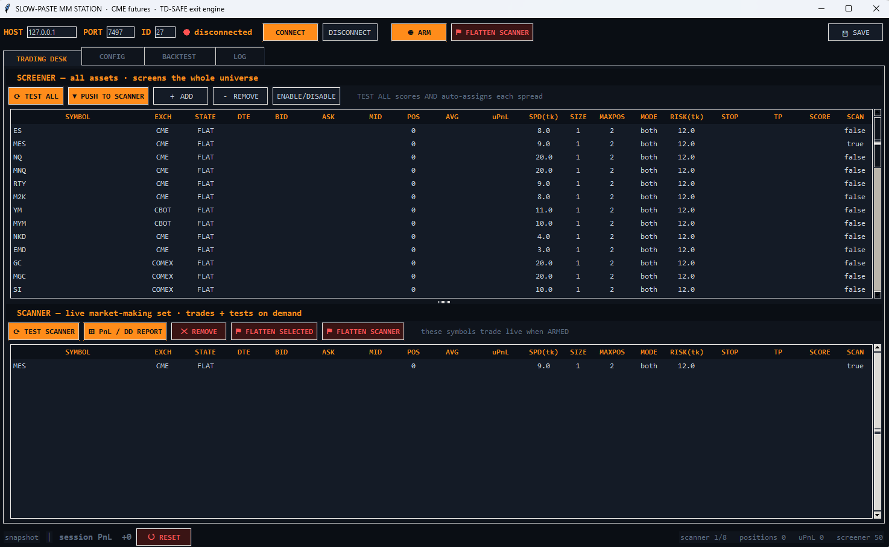
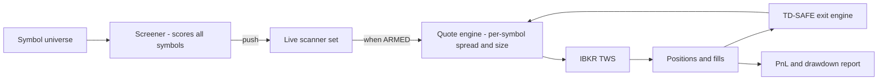

# Slow-Paste MM Station — CME Futures

**Venue:** CME / CBOT / COMEX futures via IBKR TWS · **Form:** Tkinter GUI, terminal-style trading desk

A spread-quoting (market-making style) station that screens the whole CME index and
metals universe, promotes the best candidates to a live scanner, and quotes them with a
separately validated exit layer — the **TD-SAFE exit engine**.

*Trading desk view. Top: the full-universe screener (ES/MES, NQ/MNQ, RTY/M2K, YM/MYM,
NKD, EMD, GC/MGC, SI) with per-symbol spread-in-ticks, size, max-position, mode, and
tick-risk columns. Bottom: the live scanner — the promoted set that trades when ARMED.*

## What it does

- **Two-stage universe → book pipeline.** A screener continuously scores every symbol in
  the configured universe; *Push to Scanner* promotes candidates into the live
  market-making set. Screening and trading are structurally separate lists — nothing
  trades just because it screened well.
- **Per-symbol quoting parameters.** Spread (in ticks), clip size, max position, quoting
  mode, and per-symbol tick risk are set per row, not globally.
- **TD-SAFE exit engine.** Exits are owned by a dedicated engine that was built and
  validated as its own project, with its own deterministic test battery, before being
  wired into this station.
- **On-demand testing.** *Test All* / *Test Scanner* run scoring and spread assignment
  across the board without touching live state; a PnL / drawdown report is one click.

## Safety architecture

- **ARM gate.** The scanner set only trades while explicitly ARMED — and ARMED state is
  never persisted across restarts.
- **Scoped flattening.** *Flatten Selected* and *Flatten Scanner* kill exposure at the
  row or set level without nuking unrelated positions.
- **Session snapshot bar.** Session PnL, open positions, scanner and screener counts
  always visible; one *Reset* re-baselines the session.

## Architecture

