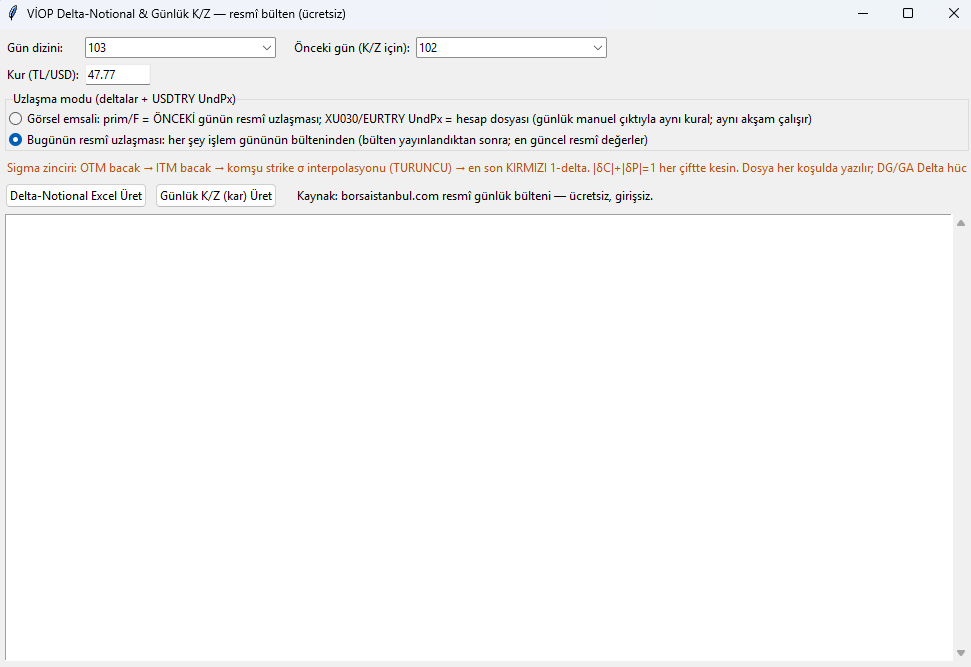
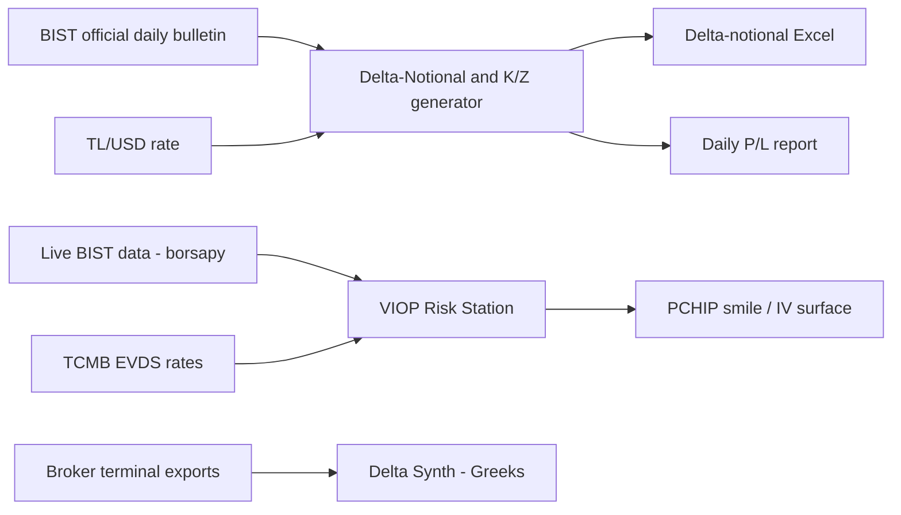

# VIOP Options Toolkit — Borsa Istanbul

**Venue:** Borsa Istanbul VIOP (index and FX derivatives) · **Form:** several Tkinter
tools sharing one data doctrine

Options risk tooling for the Turkish derivatives market — a venue with its own data
realities (official daily bulletins, TL/USD conversion, local rate curves) that
off-the-shelf tools do not handle.

*The official-bulletin Delta-Notional & Daily P/L generator (UI in Turkish). Inputs: day
index, prior day for P/L, TL/USD rate. The red line documents the sigma chain the tool
enforces; output is one click to Excel.*

## Delta-Notional & Daily P/L generator (pictured)

- **Source: the official record, for free.** Built entirely on Borsa Istanbul's public
  official daily bulletin — no vendor feed, no login — so the numbers reconcile to the
  exchange's own settlements by construction.
- **Documented sigma chain.** Per-contract deltas are derived through an explicit,
  UI-documented interpolation chain: OTM leg → ITM leg → neighbouring-strike σ
  interpolation → final 1-delta, with the put–call identity **|δC| + |δP| = 1**
  enforced on every strike pair. Nothing about the calculation is hidden from the
  operator.
- **Two settlement modes.** Deltas and underlying prices can be anchored to the previous
  day's official settlement (matching the desk's manual end-of-day process) or to the
  same day's bulletin once published — whichever official record the report needs.
- **One-click outputs.** Delta-notional Excel and daily P/L (K/Z) reports, with TL/USD
  conversion applied at the operator-set rate. The file is written under all conditions
  — a partial dataset produces a partial, honest file, never a silent failure.

## VIOP Risk Station (companion tool, build 22)

The heavier sibling, run as `viop_risk_station.py`:

- **Live BIST data** via `borsapy`, under a strict no-placeholder policy — if a field
  cannot be sourced for real, it is absent, not defaulted.
- **PCHIP smile interpolation** for implied volatility across strikes — shape-preserving,
  no oscillation artifacts at the wings.
- **Local rate integration** from the Turkish central bank's EVDS service, so
  discounting reflects actual TRY rates rather than a hardcoded constant.
- **Greeks synthesis GUI** (`VIOP_Delta_Synth.exe`) that extracts option Greeks from
  broker terminal exports when a live feed is not the right tool for the job.

## Architecture

